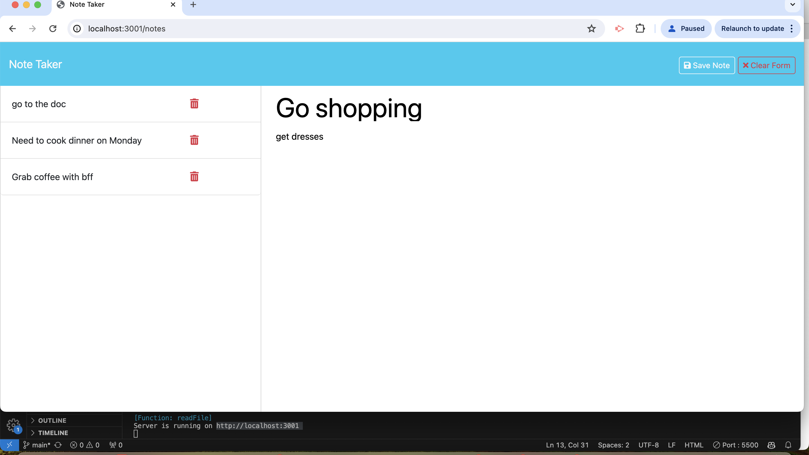

# Note-taker-challenge
Table of Contents

Description
Elements
Installation
Usage
License

Description : 
Challenge was to build the back end that will be used to store and retrieve notes from the app "Note taker" then connect the two, and  deploy the entire application to Render.

Challenge Elements:
AS A small business owner
I WANT to be able to write and save notes
SO THAT I can organize my thoughts and keep track of tasks I need to complete
Acceptance Criteria

GIVEN a note-taking application
WHEN I open the Note Taker
THEN I am presented with a landing page with a link to a notes page
WHEN I click on the link to the notes page
THEN I am presented with a page with existing notes listed in the left-hand column, plus empty fields to enter a new note title and the note’s text in the right-hand column
WHEN I enter a new note title and the note’s text
THEN a "Save Note" button and a "Clear Form" button appear in the navigation at the top of the page
WHEN I click on the Save button
THEN the new note I have entered is saved and appears in the left-hand column with the other existing notes and the buttons in the navigation disappear
WHEN I click on an existing note in the list in the left-hand column
THEN that note appears in the right-hand column and a "New Note" button appears in the navigation
WHEN I click on the "New Note" button in the navigation at the top of the page
THEN I am presented with empty fields to enter a new note title and the note’s text in the right-hand column and the button disappears.

Installation:

* Enter git clone https://github.com/saba0705/Note-taker-challenge to clone the repository.

* Install the dependencies using npm install.
* Start the server by using npm start

Usage:

* open insomnia and use POST /api/notes followed by opening the JSON tab to add the db.Json Title and text to receive a new note to save on the request body which will be added to the db.json file with a unique id. 

* render live app link : https://note-taker-challenge-punz.onrender.com 

Screenshot of app : 

License: MIT License
